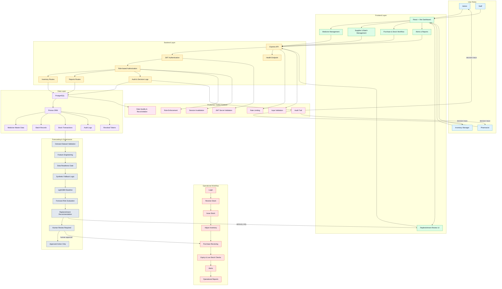

# PharmaSense Workflow Diagram

## Mermaid workflow

## Ready-to-use prompt

> Create a professional Mermaid workflow diagram for PharmaSense, a medicine inventory and forecasting platform. Use hierarchical subgraphs for User Roles, Frontend, Backend, Data Layer, Operational Workflow, Forecasting & Governance, and Production Safety Controls. Show Admin, Pharmacist, Inventory Manager, and Staff with access differences. Include React dashboard, Express API, JWT auth, Prisma/PostgreSQL persistence, medicine management, batch management, supplier records, purchase receiving, stock issue/receive/adjustment, alerts, reports, audit logging, and replenishment review. Add a forecasting pipeline with dataset validation, feature engineering, data readiness checks, synthetic fallback, LightGBM baseline, forecast risk scoring, replenishment recommendations, and human review before action. Highlight that the forecast output is advisory only and does not trigger automatic purchase execution. Include rate limiting, input validation, security controls, audit trails, and session invalidation. Use clean Mermaid syntax, clear arrow labels, and a presentation-ready structure.

## Project interpretation

The high-level operating model is:

1. Users interact with the dashboard.
2. The API validates requests and enforces roles.
3. Operational data is stored in PostgreSQL through Prisma.
4. Forecasting reads the operational demand history and builds a predictive baseline.
5. Forecast output informs replenishment decisions, but human review is required.
6. All significant actions are logged for governance and auditability.
